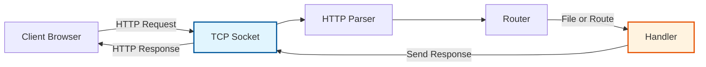

# HTTP Server

In this project, I built a basic HTTP server from scratch using only JavaScript's built-in `net` and `fs` modules. It handles multiple clients, serves static files, and implements fundamental HTTP concepts.

---

## Why Build Your Own HTTP Server?

Before jumping into the implementation, it's important to understand why we'd build something that already exists (and is much more powerful) in Node.js.

For most production applications, you should use robust frameworks like **Express**, **Fastify**, or the native **`http` module** which provide:

  - **MIME type detection**
  - **HTTP/1.1 features** like chunked encoding and persistent connections
  - **Security middleware** (CORS, rate limiting, etc.)
  - **Error handling**
  - **Middleware support**

However, building a simple HTTP server from scratch is an excellent educational exercise because it:

  - Forces you to understand **TCP/IP sockets** at a lower level
  - Clarifies **how HTTP works under the hood**
  - Makes you appreciate the **complexity hidden** in modern frameworks
  - Helps you **debug network issues** more effectively
  - Builds **foundational backend skills**

Think of it like building a car engine from scratch — you don't do it for your daily driver, but you absolutely should do it once to truly understand how cars work.

## Architecture Overview

The server has two main components:



**Key Components:**

1. **TCP Server** - Listens for incoming connections using Node.js `net`
2. **HTTP Parser** - Parses raw TCP data into structured HTTP requests
3. **Router** - Maps URLs to specific handler functions
4. **Handlers** - Process requests and generate responses

## Implementation

### Step 1: Setting up the TCP Server

We start by creating a TCP server that listens on a specified port (typically 3000 or 8080 for development).

```js
const net = require('net');
const fs = require('fs');

const server = net.createServer((socket) => {
  // Handle connection here
});

server.listen(3000, () => {
  console.log('Server running on port 3000');
});
```

Each client connection is represented by a `socket` object.

### Step 2: Parsing the HTTP Request

When data arrives on the socket, we need to parse it into an HTTP request object. A raw HTTP request looks like this:

```
GET /index.html HTTP/1.1
Host: localhost:3000
User-Agent: curl/7.68.0
Accept: */*

<request body here (if any)>
```

Our parser needs to extract:

  - **Method** (GET, POST, etc.)
  - **URL** (`/index.html`)
  - **HTTP version** (`HTTP/1.1`)
  - **Headers** (`Host`, `User-Agent`, etc.)
  - **Body** (for POST/PUT requests)

```js
function parseRequest(data) {
  const lines = data.split('\r\n');
  const [method, url, version] = lines[0].split(' ');

  const headers = {};
  let body = '';
  let i = 1;

  // Parse headers
  while (i < lines.length && lines[i] !== '') {
    const [key, ...values] = lines[i].split(': ');
    headers[key.toLowerCase()] = values.join(': ').trim();
    i++;
  }

  // Parse body (if any)
  if (i < lines.length) {
    body = lines.slice(i).join('\r\n');
  }

  return { method, url, version, headers, body };
}
```

### Step 3: Routing Requests

Once we have the request, we route it to the appropriate handler function based on the URL path.

For a simple static file server, we can handle a few common routes:

  - `/` - Root path, usually serves `index.html`
  - `/api/...` - API routes
  - `*` - Any other path, try to serve the file

```js
function router(request, response) {
  const { method, url } = request;

  if (method === 'GET') {
    if (url === '/') {
      serveFile(response, 'index.html');
    } else if (url.startsWith('/api/')) {
      handleApi(response, request);
    } else {
      serveFile(response, url.substring(1)); // Remove leading '/' to match filename
    }
  } else if (method === 'POST') {
    handlePost(response, request);
  } else {
    send405(response);
  }
}
```

### Step 4: Serving Static Files

This is the core functionality of a basic web server. We read the file from the file system and send it to the client.

```js
function serveFile(response, filePath) {
  fs.readFile(filePath, (err, data) => {
    if (err) {
      send404(response);
      return;
    }

    response.write(data);
    response.end();
  });
}
```

**Important:** In a real implementation, you should:

  - Check that the file is within your `public` directory (security)
  - Determine the correct **MIME type** (e.g., `text/html`, `image/jpeg`)
  - Add proper **caching headers**

### Step 5: Sending the HTTP Response

After handling the request, we need to send an HTTP response. A response has:

  - **Status line** (`HTTP/1.1 200 OK`)
  - **Headers** (`Content-Type`, `Content-Length`)
  - **Body** (the actual content)

```js
function sendResponse(response, { status = 200, headers = {}, body }) {
  response.write(`HTTP/1.1 ${status} OK\r\n`);
  
  // Add default headers
  if (!headers['Content-Type']) {
    headers['Content-Type'] = 'text/html';
  }
  if (!headers['Content-Length']) {
    headers['Content-Length'] = Buffer.byteLength(body);
  }

  // Write headers
  for (const [key, value] of Object.entries(headers)) {
    response.write(`${key}: ${value}\r\n`);
  }
  response.write('\r\n'); // Blank line separates headers from body

  // Write body
  response.write(body);
  response.end();
}
```

### Helper Functions

It's useful to have helper functions for common HTTP status codes:

```js
function send404(response) {
  sendResponse(response, {
    status: 404,
    body: '<h1>404 Not Found</h1><p>The page you are looking for does not exist.</p>'
  });
}

function send405(response) {
  sendResponse(response, {
    status: 405,
    body: '<h1>405 Method Not Allowed</h1><p>This HTTP method is not supported.</p>'
  });
}
```

### Handling Multiple Clients

Our initial `net.createServer` already supports multiple clients because it emits a `'connection'`